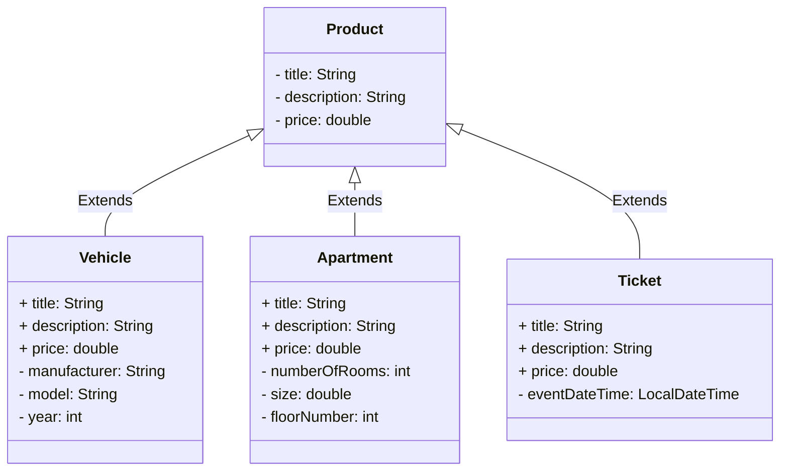

# Inheritance and interfaces

This repository contains a set of Java exercises to help you get acquainted with inheritance and interfaces.

For this exercise, we recommend the following self-study materials:

* [Objects, Classes, Interfaces, Packages, and Inheritance (dev.java)](https://dev.java/learn/oop/)
* [Java Polymorphism Fully Explained In 7 Minutes (Coding with John, YouTube)](https://youtu.be/jhDUxynEQRI)
* [Super Keyword in Java Full Tutorial - How to Use "super" (Coding with John, YouTube)](https://www.youtube.com/watch?v=Qb_NUn0TSAU)

Additionally, you should independently seek information from various sources.

## Starting the exercise

Start by cloning the Git repository to your local machine. The exercise must be done in your own copy, so make sure the repository URL includes your GitHub username! You can create your own copy through the GitHub Classroom link provided in your course assignment.

```sh
git clone https://github.com/make-sure-that-the-repository-address-contains-your-account.git
```

After cloning the project to your local machine, open it in your code editor.

## Submitting solutions

Once you have solved some or all of the tasks and committed your answers, submit the solutions for evaluation using the `git push` command. Git push will automatically trigger a GitHub Actions workflow that compiles and tests your solutions, providing a pass or fail result for each test.

Once the GitHub Actions has executed your code, you see the results in your GitHub repository's [Actions tab](../../actions/workflows/classroom.yml). It usually takes a few minutes for the assesment to be completed. 

By clicking on the latest *"GitHub Classroom Workflow"* execution from the link above, you will get detailed information about the task evaluation. At the bottom of the page, you can see the points you received. By clicking on the "Autograding" heading, you can view the steps performed during the evaluation and their results in more detail. You can find an illustrated guide on this topic in the GitHub documentation [View autograding results (github.com)](https://docs.github.com/en/education/manage-coursework-with-github-classroom/learn-with-github-classroom/view-autograding-results).

💡 *You can submit your solution for evaluation as many times as needed until the task deadline. However, make sure that the latest submission yields the best points, as only the most recent points will be valid.*

### Part 1: inheritance *(basics, 10 % + 10 %)*

In the [inheritance.webshop](./src/main/java/inheritance/webshop/) package of this task template, there are four Java classes designed to model products in a fictional web-based buying and selling service. By default, all products, regardless of type, contain the information defined in the [`Product`](./src/main/java/inheritance/webshop/Product.java) class (title, description, price). There are separate classes for [vehicles](./src/main/java/inheritance/webshop/Vehicle.java), [apartments](./src/main/java/inheritance/webshop/Apartment.java), and [tickets](./src/main/java/inheritance/webshop/Ticket.java), which include additional information specific to these products:



Tässä tehtävässä sinun tulee ensin toteuttaa [`Product`](./src/main/java/inheritance/webshop/Product.java)-luokka siinä olevien kommenttien mukaisesti. Kun olet saanut `Product`-luokan toteutettua ja se läpäisee luokalle kirjoitetut testit, toteuta [`Vehicle`](./src/main/java/inheritance/webshop/Vehicle.java)-luokka siihen kirjoitettujen kommenttien mukaisesti.

Molemmille luokille on omat testit: [ProductTest](./src/test/java/inheritance/webshop/ProductTest.java) ja [VehicleTest](./src/test/java/inheritance/webshop/VehicleTest.java). Voit suorittaa testit koodieditorisi testaustyökalulla ([VS Code](https://code.visualstudio.com/docs/java/java-testing), [Eclipse](https://www.vogella.com/tutorials/JUnitEclipse/article.html)) tai [Gradle-automaatiotyökalulla](https://docs.gradle.org/current/userguide/java_testing.html):

In this task, you should first implement the  [`Product`](./src/main/java/inheritance/webshop/Product.java) class according to the comments within it. Once you have implemented the `Product` class and it passes the tests written for the class, implement the [`Vehicle`](./src/main/java/inheritance/webshop/Vehicle.java) class according to the comments written within it.

Both classes have their own tests: [ProductTest](./src/test/java/inheritance/webshop/ProductTest.java) and [VehicleTest](./src/test/java/inheritance/webshop/VehicleTest.java). You can run the tests either using your code editor's testing tool ([VS Code](https://code.visualstudio.com/docs/java/java-testing), [Eclipse](https://www.vogella.com/tutorials/JUnitEclipse/article.html)) or using the [Gradle tool](https://docs.gradle.org/current/userguide/java_testing.html):

```sh
./gradlew test --tests ProductTest      # unix
.\gradlew.bat test --tests ProductTest  # windows
```

```sh
./gradlew test --tests VehicleTest      # unix
.\gradlew.bat test --tests VehicleTest  # windows
```

The [`Apartment`](./src/main/java/inheritance/webshop/Apartment.java) and [`Ticket`](./src/main/java/inheritance/webshop/Ticket.java) classes can be found in the same directory, and you can continue practicing inheritance independently with them. The implementation of these classes is so similar to the `Vehicle` class that there are no automatic tests for them, and they are not separately considered in the task evaluation.

### Part 2: polymorphism *(applying, 20%)*

Objects of the subclasses you implemented using inheritance can be used in place of superclass objects, for example, in collections or as method parameters. Complete the methods in the [`WebShop`](./src/main/java/inheritance/webshop/WebShop.java) class to practice using different types of objects together and, if necessary, to learn to identify which class an object actually belongs to at any given time.

This part is checked using the [`WebShopTest`](./src/test/java/inheritance/webshop/WebShopTest.java) class, which you can run in your code editor or with Gradle:

```sh
./gradlew test --tests WebShopTest      # unix
.\gradlew.bat test --tests WebShopTest  # windows
```

💡 *This part utilizes the `Product` and `Vehicle` classes implemented in the previous section, so make sure the previous section works before proceeding to this one.*

### Osa 3: Comparable-rajapinta *(perusteet, 20 %)*

[Country.java](./src/main/java/interfaces/country/Country.java)-tiedostossa on valmiiksi toteutettu tyypillinen Java-luokka, jonka tarkoitus on mallintaa maita ja niiden väkilukuja. Jatkokehitä tätä luokkaa siten, että se toteuttaa `Comparable<Country>`-rajapinnan.

`Comparable`-rajapinta [löytyy javasta valmiina](https://docs.oracle.com/en/java/javase/21/docs/api/java.base/java/lang/Comparable.html) ja se sisältää vain yhden metodin: `compareTo`. Toteuta tämä metodi luokassa esitettyjen sääntöjen mukaisesti. Voit testata ratkaisuasi joko valmiin [`CountryMain`](./src/main/java/interfaces/country/CountryMain.java)-pääohjelmaluokan tai [`CountryTest`](./src/test/java/interfaces/country/CountryTest.java)-yksikkötestiluokan avulla:

```sh
./gradlew test --tests CountryTest      # unix
.\gradlew.bat test --tests CountryTest  # windows
```

### Osa 4: oman rajapinnan toteuttaminen *(soveltava, 10 % + 10 %)*

**MarkdownExport-rajapinta**

Tehtävän tässä osassa sinun tulee toteuttaa itse oma rajapinta nimeltä `MarkdownExport`. Rajapinta toteutetaan tiedostoon [MarkdownExport.java](./src/main/java/interfaces/markdown/MarkdownExport.java). Määrittele tähän rajapintaan yksi metodi: `exportMarkdown()`. Metodi ei saa ottaa parametreja ja sen tulee palauttaa merkkijono.

Rajapinnan tarkoituksena on määritellä sen toteuttaville luokille `exportMarkdown()`-metodi, joka muodostaa oliosta [markdown](https://www.markdownguide.org/)-muotoisen merkkijonoesityksen esimerkiksi tiedostoon tallentamista varten. Tehtävän ratkaisemiseksi sinun ei tarvitse tuntea Markdown-syntaksia, riittää että seuraat annettuja esimerkkejä.

**Pizza-luokka**

Kun olet määritellyt edellä mainitun rajapinnan, muokkaa tehtäväpohjan valmista [`Pizza`-luokkaa](./src/main/java/interfaces/markdown/Pizza.java) siten, että se toteuttaa kyseisen rajapinnan.

Pizza-luokan `exportMarkdown()`-metodin palauttamassa merkkijonossa on oltava pizzan nimi otsikkona (`# nimi`) sekä lista täytteistä (`- täyte`). Merkkijonon lopussa on oltava pizzan hinta, esimerkiksi seuraavasti:

```md
# Hawaiian

Toppings:
- ham
- pineapple
- mozarella

Price: 10.90
```

MarkdownExport-rajapinta sekä Pizza-luokka testataan valmiilla [`MarkdownExportTest`-testiluokalla](./src/test/java/interfaces/markdown/MarkdownExportTest.java):

```sh
./gradlew test --tests MarkdownExportTest      # unix
.\gradlew.bat test --tests MarkdownExportTest  # windows
```

**Product-luokka**

Jatkokehitä vielä tämän tehtäväpaketin edellisessä osassa kehitettyä [`Product`-luokkaa](./src/main/java/inheritance/webshop/Product.java) siten, että myös se toteuttaa [`MarkdownExport`-rajapinnan](./src/main/java/interfaces/markdown/MarkdownExport.java). Tuotteiden osalta markdown-esityksessä täytyy olla tuotteen nimi, kuvaus ja hinta, mutta muuten voit määritellä merkkijonon muodon vapaasti.

Koska `Product`-luokka sijaitsee eri paketissa kuin MarkdownExport-rajapinta, tulee siihen kirjoittaa `import`-komento: `import interfaces.markdown.MarkdownExport;`

`Product`-luokan osalta tehtävä tarkastetaan erillisellä [`ProductMarkdownTest`-testiluokalla](./src/test/java/interfaces/markdown/ProductMarkdownTest.java):

```sh
./gradlew test --tests ProductMarkdownTest      # unix
.\gradlew.bat test --tests ProductMarkdownTest  # windows
```

💡 *Huomaa, että koska `Vehicle`-luokka perii `Product`-luokan, myös `Vehicle` täyttää tämän rajapinnan "automaattisesti". Jos haluat, että ajoneuvoilla on erilainen markdown-esitys kuin muilla tuotteilla, voit vapaasti toteuttaa siihen erilaisen toteutuksen exportMarkdown-metodista.*


### Osa 5: "dependency injection" *(edistynyt, 20 %)*

Viimeisenä osana tässä tehtäväpaketissa on perintää soveltava "dependency injection"-esimerkki:

> *"In software engineering, dependency injection is a programming technique in which an object or function receives other objects or functions that it requires, as opposed to creating them internally. Dependency injection aims to separate the concerns of constructing objects and using them, leading to loosely coupled programs"*
>
> Dependency injection. Wikipedia. https://en.wikipedia.org/wiki/Dependency_injection

Tehtävän viimeisen osan ratkaiseminen vaatii vain minimaalisen muutoksen lähdekoodiin. Pääpaino tässä osassa onkin siinä, että perehdyt annettuihin luokkiin ja niissä esitettyihin kommentteihin:

* [`Main`](./src/main/java/dependency_injection/Main.java)

  *Tehtävän keskeisin tehtävänanto löytyy tästä luokasta. Tämä on ainoa luokka, jota tässä osassa tulee muuttaa.*

* [`Application`](./src/main/java/dependency_injection/Application.java)
* [`PrinterWithTimestamp`](./src/main/java/dependency_injection/PrinterWithTimestamp.java)

Koska tehtävässä ei juurikaan koodata, ei sille ole valmista yksikkötestiä. Varmista ohjelman ja tekemäsi muutoksen toimivuus suorittamalla [`Main`](./src/main/java/dependency_injection/Main.java)-pääohjelmaluokkaa ja tutustu ohjelman tulosteisiin. Tehtävä arvioidaan automaattisesti suorittamalla `Main`-luokka Gradle:n avulla ja tutkimalla sen tulosteita:

```sh
./gradlew run      # unix
.\gradlew.bat run  # windows
```


## Lisenssi ja tekijät

Tämän tehtävän on kehittänyt Teemu Havulinna ja se on lisensoitu [Creative Commons BY-NC-SA -lisenssillä](https://creativecommons.org/licenses/by-nc-sa/4.0/).

Tehtävänannon, lähdekoodien ja testien toteutuksessa on hyödynnetty ChatGPT 3.5 -kielimallia sekä GitHub copilot -tekoälyavustinta.
